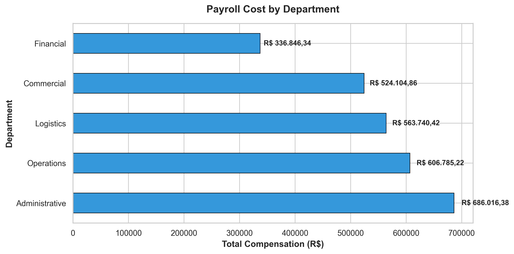
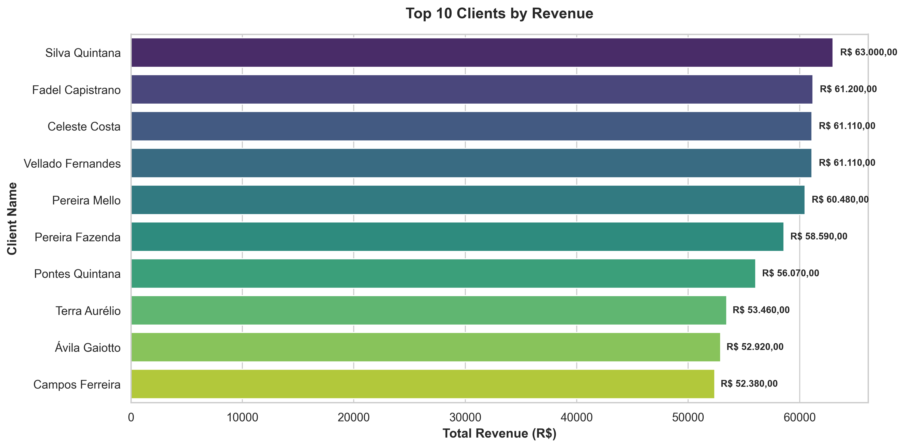
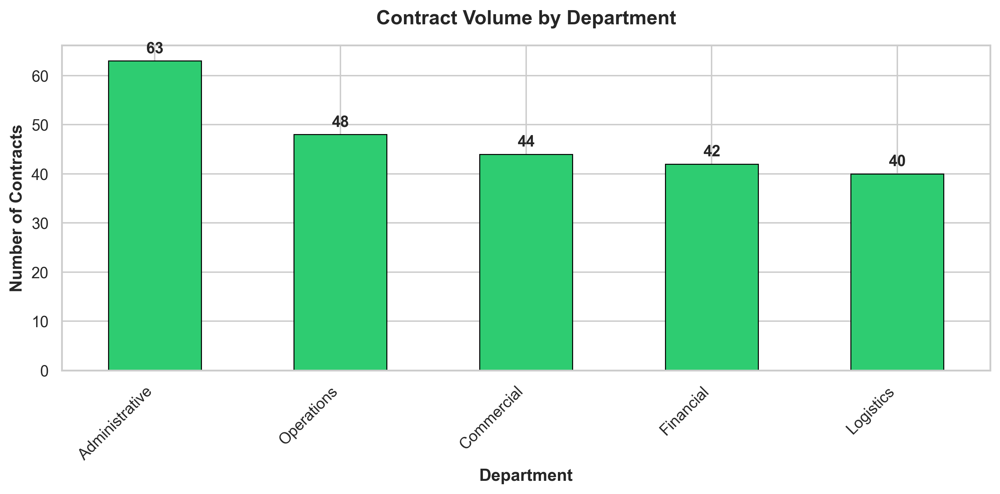
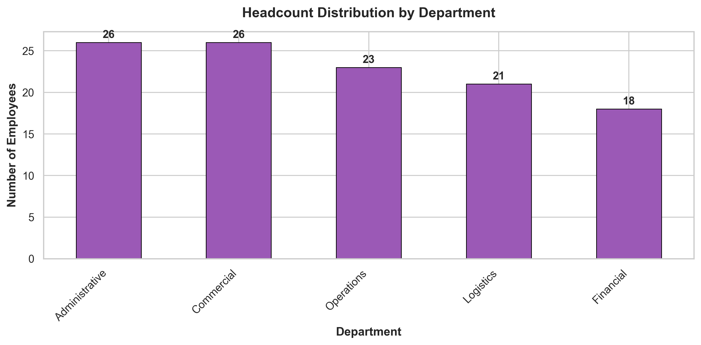

# 📊 Business Performance Analysis


## 🎯 Project Overview

Professional business performance analysis focusing on payroll optimization, revenue growth, and employee productivity across multiple departments.

**Business Challenge:** Leadership needs data-driven insights into cost structure, revenue patterns, and workforce efficiency to guide strategic decisions.

**Solution:** Comprehensive Python-based analysis of HR, client, and service data delivering actionable recommendations for cost reduction and revenue growth.

---

## 📈 Key Findings

### 💰 Financial Performance
- **Total Monthly Payroll:** R$ 226,932
- **Total Company Revenue:** R$ 2,850,768
- **Average Contract Value:** R$ 2,502.56
- **Revenue Concentration:** Top 3 clients = 28.5% of total revenue

### 👥 Workforce Metrics
- **Employee Activity Rate:** 86.8%
- **Inactive Employees:** 13.2% (training opportunity)
- **Highest Cost Center:** Administrative department
- **Best Performing:** Commercial department (contract volume)

### 🎯 Strategic Opportunities
- **15% potential cost savings** through Administrative automation
- **€XXX,XXX revenue upside** from training inactive employees
- **Client diversification** needed to reduce concentration risk
- **Tiered pricing strategy** to capture broader market segments

---

## 📊 Data Visualizations

### Payroll Distribution


*Administrative department shows highest costs - prime candidate for process automation and efficiency improvements.*

---

### Revenue Performance


*Concentrated revenue base in top clients presents both opportunity (upselling) and risk (dependency).*

---

### Department Performance


*Commercial department leads in contract volume as expected, while Operations shows strong secondary performance.*

---

### Workforce Allocation


*Headcount allocation reveals potential for resource rebalancing based on workload and revenue contribution.*

---

## 🗂️ Project Structure
```
business-analysis/
├── data/
│   ├── clients.csv              # Client contracts and demographics
│   ├── employees.csv            # Employee compensation data
│   └── services.xlsx            # Service delivery records
├── notebooks/
│   └── business_analysis.ipynb  # Complete analysis workflow
├── outputs/
│   ├── payroll_by_department.png
│   ├── top_10_clients.png
│   ├── contracts_by_department.png
│   └── headcount_by_department.png
├── .gitignore
├── requirements.txt
└── README.md
```

---

## 💡 Business Recommendations

### Cost Optimization
✅ **Automate Administrative processes** (highest cost center)  
✅ **Implement performance-based compensation** aligned with revenue generation  
✅ **Right-size teams** based on workload analysis  

### Revenue Growth
✅ **Upsell top 10 clients** (proven relationships, high trust)  
✅ **Develop tiered service packages** (entry, standard, premium)  
✅ **Cross-sell services** between departments  
✅ **Reduce client concentration** through targeted acquisition  

### Talent Development
✅ **Commercial training** for 13% inactive employees  
✅ **Knowledge sharing** from top performers  
✅ **Performance metrics** tied to contract generation  

---

## 🛠️ Technical Stack

### Data Processing
- **Pandas** - Data manipulation and aggregation
- **NumPy** - Numerical computations
- **OpenPyXL** - Excel file handling

### Visualization
- **Matplotlib** - Core plotting library
- **Seaborn** - Statistical visualizations

### Analysis Approach
- Multi-source data integration (CSV, Excel)
- Feature engineering (total compensation calculation)
- Departmental comparative analysis
- Client segmentation and ranking

---

## 🚀 How to Run

### Prerequisites
```bash
Python 3.8+
Jupyter Notebook
```

### Installation

1. **Clone repository**
```bash
git clone https://github.com/Luiz-mila/business-analysis.git
cd business-analysis
```

2. **Install dependencies**
```bash
pip install -r requirements.txt
```

3. **Add data files**
Place CSV/Excel files in `data/` folder:
- `clients.csv`
- `employees.csv`
- `services.xlsx`

4. **Run analysis**
```bash
jupyter notebook notebooks/business_analysis.ipynb
```

5. **View results**
All visualizations saved automatically to `outputs/` folder.

---

## 📚 Data Schema

### Employees (`employees.csv`)
- `employee_id` - Unique identifier
- `full_name` - Employee name
- `department` - Administrative, Commercial, Financial, Operations, Logistics
- `base_salary`, `taxes`, `benefits` - Compensation components
- `transportation_allowance`, `meal_allowance` - Additional benefits

### Clients (`clients.csv`)
- `client_id` - Unique identifier
- `client_name` - Client company/individual
- `monthly_contract_value` - Recurring monthly revenue
- `registration_date`, `profession`, `state` - Demographics

### Services (`services.xlsx`)
- `employee_id`, `client_id` - Relationship keys
- `service_date`, `service_type` - Service details
- `contract_duration_months` - Contract length
- `monthly_contract_value` - Recurring revenue

---

## 🎓 Skills Demonstrated

### Business Analysis
✅ Financial analysis (payroll, revenue, profitability)  
✅ Workforce productivity metrics  
✅ Departmental performance comparison  
✅ Client segmentation and concentration risk  

### Python & Data Science
✅ Multi-source data integration  
✅ Pandas for data transformation  
✅ Feature engineering  
✅ Statistical analysis  

### Data Visualization
✅ Professional chart design  
✅ Executive dashboard creation  
✅ Strategic insight communication  

### Strategic Thinking
✅ Actionable recommendations  
✅ Cost-benefit analysis  
✅ Growth opportunity identification  
✅ Risk assessment  

---

## 👤 Author

**Luiz Milaré**  
Business Intelligence & Data Analyst

Data professional focused on transforming complex datasets into strategic insights. Experienced in revenue analysis, performance metrics, and behavioral pattern detection.

📧 Email: luizmilare958@gmail.com

💼 LinkedIn: www.linkedin.com/in/luiz-milar%C3%A9-a5869519a/

🐙 GitHub: https://github.com/Luiz-mila

---

## 📄 License

This project is for educational and portfolio purposes.

---

## 🙏 Acknowledgments

Analysis framework inspired by real-world business consulting practices and data-driven decision-making methodologies.